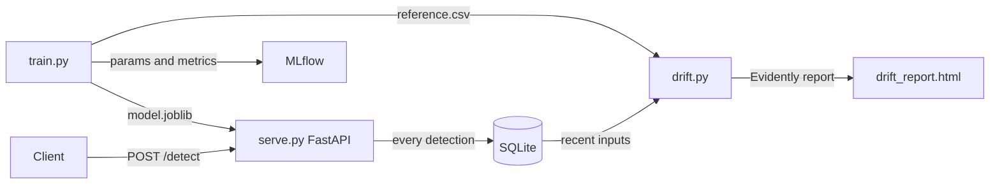

# MLOps Anomaly Detection


Detects anomalies in sensor readings using IsolationForest, with MLflow experiment tracking, Evidently drift detection, and GitHub Actions CI/CD.

## How it works

The model learns what "normal" sensor behavior looks like during training. When a new reading comes in, it scores how far that reading deviates from normal. Readings that deviate too far are flagged as anomalies.

This approach is unsupervised, meaning no labeled anomaly data is needed at training time.

## Architecture



## Tech Stack

| Layer | Technology |
|---|---|
| Language | Python 3.11 |
| Model | IsolationForest (scikit-learn) |
| Experiment Tracking | MLflow |
| Drift Detection | Evidently AI |
| API | FastAPI + Uvicorn |
| Containerization | Docker + Docker Compose |
| CI/CD | GitHub Actions |
| Testing | Pytest |

## Quick Start

**Install dependencies**

```bash
pip install -r requirements.txt
```

**Train the model**

```bash
python src/train.py
mlflow ui
```

**Serve the API**

```bash
uvicorn src.serve:app --reload
```

**Check for data drift**

```bash
python src/drift.py
```

**Run with Docker Compose**

```bash
docker-compose up --build
```

| Service | URL |
|---|---|
| API | http://localhost:8000 |
| Swagger docs | http://localhost:8000/docs |
| MLflow UI | http://localhost:5000 |

## API Endpoints

| Method | Endpoint | Description |
|---|---|---|
| GET | `/health` | Readiness probe |
| POST | `/detect` | Classify a sensor reading |
| GET | `/logs` | Recent detections |
| GET | `/stats` | Anomaly rate and counts |

**Example request:**

```bash
curl -X POST http://localhost:8000/detect \
  -H "Content-Type: application/json" \
  -d '{
    "temperature": 145.0,
    "vibration": 2.8,
    "pressure": 190.0,
    "rotation_speed": 2800.0
  }'
```

```json
{"is_anomaly": true, "anomaly_score": -0.3142}
```

## Running Tests

```bash
pytest tests/ -v
```

## CI/CD

Every push to `main` trains the model, runs the test suite, then builds and smoke-tests the Docker image.

## License

Released under the MIT License. See [LICENSE](LICENSE).
