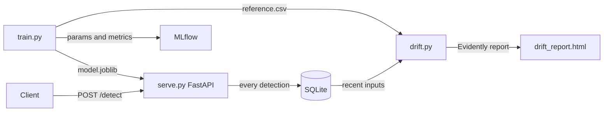

# MLOps Anomaly Detection


Scores sensor readings with an IsolationForest. There are no anomaly labels, so the model learns the shape of normal machine operation and the caller picks a score cutoff per request instead of a probability threshold. Same MLflow and Evidently setup as the rest of the series.

## How it works

The model learns what "normal" sensor behavior looks like during training. When a new reading comes in, it scores how far that reading deviates from normal. Readings that deviate too far are flagged as anomalies.

This approach is unsupervised, meaning no labeled anomaly data is needed at training time.

## Results

`src/train.py` logs precision, recall, F1 and the observed anomaly ratio to MLflow on every run, but there is no table here because those numbers describe the data generator rather than the detector. The synthetic anomalies in `generate_data` sit in temperature, pressure and speed bands that barely overlap the normal readings, so almost anything separates them and the scores land near 1.00.

Treat them as a smoke test that the training path runs. Judging the detector needs real sensor data, where failures are gradual.

## Architecture



## Tech Stack

| Layer | Technology |
|---|---|
| Language | Python 3.11 |
| Model | IsolationForest (scikit-learn) |
| Experiment Tracking | MLflow |
| Drift Detection | Evidently AI |
| API | FastAPI + Uvicorn |
| Containerization | Docker + Docker Compose |
| CI/CD | GitHub Actions |
| Testing | Pytest |

## Quick Start

**Install dependencies**

```bash
pip install -r requirements.txt
```

**Train the model**

```bash
python src/train.py
mlflow ui
```

**Serve the API**

```bash
uvicorn src.serve:app --reload
```

**Check for data drift**

```bash
python src/drift.py
```

**Run with Docker Compose**

```bash
docker-compose up --build
```

| Service | URL |
|---|---|
| API | http://localhost:8000 |
| Swagger docs | http://localhost:8000/docs |
| MLflow UI | http://localhost:5000 |

CI publishes the API image to GHCR on every push to `main`:

```bash
docker pull ghcr.io/yigitliman/anomaly-detection:latest
```

## API Endpoints

| Method | Endpoint | Description |
|---|---|---|
| GET | `/health` | Readiness probe |
| POST | `/detect` | Classify a sensor reading |
| GET | `/logs` | Recent detections |
| GET | `/stats` | Anomaly rate and counts |

**Example request:**

```bash
curl -X POST http://localhost:8000/detect \
  -H "Content-Type: application/json" \
  -d '{
    "temperature": 145.0,
    "vibration": 2.8,
    "pressure": 190.0,
    "rotation_speed": 2800.0
  }'
```

```json
{"is_anomaly": true, "anomaly_score": -0.3142}
```

## Running Tests

```bash
pytest tests/ -v
```

## CI/CD

Every push to `main` trains the model, runs the test suite, then builds and smoke-tests the Docker image.

## License

Released under the MIT License. See [LICENSE](LICENSE).
